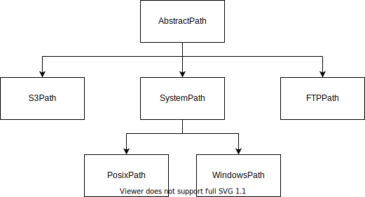

# Background

FilePaths.jl and FilePathsBase.jl have gone through several design iterations over the years.
To help get potential contributors up-to-speed, we'll cover several background points and design choices.
Whenever possible, we'll reference existing resources (e.g., GitHub issues, blog posts, documentation, software packages) for further reading.

## Filesystem Abstractions

While filesystems themselves are abstractions for data storage, many programming languages
provide APIs for writing generic/cross-platform software.
Typically, these abstractions can be broken down into string or typed based solutions.

### String APIs:

- Python: [`os.path`](https://docs.python.org/3.8/library/os.path.html)
- Haskell: [`System.FilePath`](https://hackage.haskell.org/package/filepath-1.4.2.1/docs/System-FilePath.html)
- Julia: [`Base.Filesystem`](https://docs.julialang.org/en/v1/base/file/)

This approach tends to be simpler and only requires adding utility methods for interacting with filesystems. Unfortunately, any operations require significant string manipulation to work, and it often cannot be extended for remote filesystems (e.g., S3, FTP, HTTP). Enforcing path validity becomes difficult when any string operation can be applied to the path type (e.g., `join(prefix, segments...)` vs `joinpath(prefix, segments...)`).

### Typed APIs:

- Python: [`pathlib`](https://docs.python.org/3/library/pathlib.html)
- Rust: [`std::path`](https://doc.rust-lang.org/std/path/index.html)
- C++: [`std::filesystem`](https://en.cppreference.com/w/cpp/filesystem/path)
- Haskell: [`path`](https://hackage.haskell.org/package/path)
- Scala: [`os-lib`](https://github.com/lihaoyi/os-lib)

The primary idea is that a filesystem path is just a sequence of path segments, and so very few path operations overlap with string operations.
For example, you're unlikely to call string functions like `join(...)`, `chomp(...)`, `eachline(...)`, `match(regex, ...)` or `parse(Float64, ...)` with a filesystem path.
Further, differentiating strings and paths allows us to define different equality rules and dispatch behaviour on filepaths in our APIs.
Finally, by defining a common API for all `AbstractPaths`, we can write generic functions that work with `PosixPath`s, `WindowsPath`s, `S3Path`s, `FTPPath`s, etc.

## Path Types

In FilePathsBase.jl, file paths are first and foremost a type that wraps a tuple of strings, representing path `segments`.
Most path types will also include a `root`, `drive` and `separator`.
Concrete path types should either directly subtype `AbstractPath` or in the case of local filesystems (e.g., `PosixPath`, `WindowsPath`) from `SystemPath`, as shown in the diagram below.

Notice that our `AbstractPath` type no longer subtypes `AbstractString` like some other libraries.
We [chose](https://github.com/rofinn/FilePathsBase.jl/issues/15) drop string subtyping because not all `AbstractString` operations make sense on paths, and even more seem like they should perform a fundamentally different operation as mentioned above.
Similar points have been made for [why `pathlib.Path` doesn't inherit from `str` in Python](https://snarky.ca/why-pathlib-path-doesn-t-inherit-from-str/).
